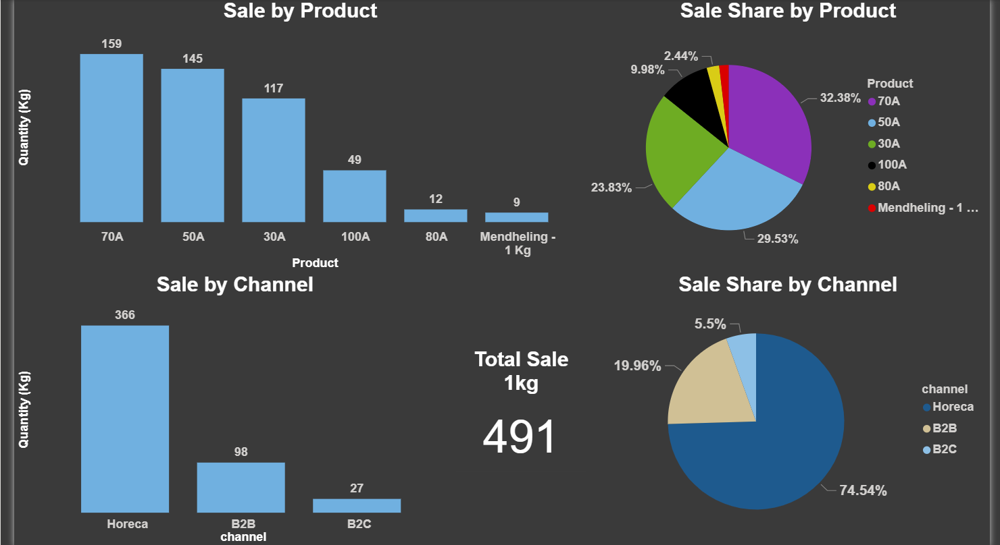

# Monthly Sales Data Dashboard 📊

## Overview

This is a simple data analysis project using **Google Sheets** and
**Power BI**.\
The goal was to clean and analyze monthly sales data and create an
interactive dashboard to track KPIs by **Product** & **Sales Channel**.

## Tools

-   Google Sheets (Data cleaning & preparation)\
-   Power BI (Data visualization & dashboard)

## Key Insights

-   Total Sales by Channel & by Product\
-   Sales Share by Product & Channel\
-   Top Customers\
-   Monthly Sales Trend

## Dashboard

Here is a preview of the dashboard created in Power BI:

------------------------------------------------------------------------
